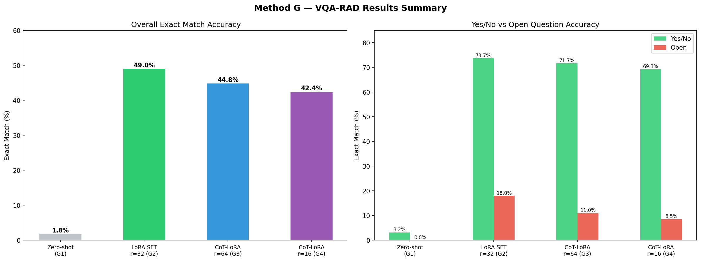

# Medical VLM for Radiology Image QA

Fine-tuning Qwen2-VL-7B-Instruct on VQA-RAD with LoRA and Chain-of-Thought reasoning.

## Results

### Exact Match (original metric)

| Method | Exact Match | Yes/No | Open |
|--------|------------|--------|------|
| Zero-shot baseline | 1.8% | 3.2% | 0.0% |
| LoRA SFT (r=32) | 49.0% | 73.7% | 18.0% |
| CoT-LoRA (r=64) | 44.8% | 71.7% | 11.0% |
| CoT-LoRA (r=16) | 42.4% | 69.3% | 8.5% |

### Contains Match (improved metric)

| Method | Contains Match | Yes/No | Open |
|--------|---------------|--------|------|
| Zero-shot baseline | 54.5% | 76.5% | 27.0% |
| LoRA SFT (r=32) | 57.4% | 74.9% | 35.5% |
| CoT-LoRA (r=64) | 54.5% | 73.3% | 31.0% |
| CoT-LoRA (r=16) | 53.0% | 72.9% | 28.0% |

> **Key Finding:** Zero-shot exact match (1.8%) severely underestimates true capability.
> Contains match reveals zero-shot already achieves 76.5% on Yes/No questions.
> LoRA fine-tuning primarily improves output format consistency rather than medical understanding.



## Key Findings

- LoRA fine-tuning achieves **27x improvement** over zero-shot baseline (1.8% → 49.0%)
- Yes/No questions benefit most from fine-tuning (3.2% → 73.7%)
- CoT training reduces exact match on open questions due to verbose output format — a known limitation of string-matching evaluation
- LoRA rank has modest effect on Yes/No accuracy (73.7% vs 69.3%) but larger effect on open questions (18.0% vs 8.5%)

## Dataset

[VQA-RAD](https://huggingface.co/datasets/flaviagiammarino/vqa-rad) — 2,244 radiology QA pairs (1,793 train / 451 test)
- 315 radiology images (chest X-ray, CT, MRI)
- Question types: Yes/No (56%) and Open (44%)

## Model

Base model: [Qwen2-VL-7B-Instruct](https://huggingface.co/Qwen/Qwen2-VL-7B-Instruct)

## Experimental Setup

| Group | Method | LoRA Rank | CoT |
|-------|--------|-----------|-----|
| G1 | Zero-shot | — | — |
| G2 | LoRA SFT | r=32 | No |
| G3 | CoT-LoRA | r=64 | Yes |
| G4 | CoT-LoRA (ablation) | r=16 | Yes |

Training config: 3 epochs, batch size 4, grad accum 8, lr 2e-4, cosine scheduler

## Setup
```bash
pip install transformers accelerate peft bitsandbytes trl datasets pillow
```

## Project Structure
```
physio_g/
├── data/
│   ├── train.json
│   ├── test.json
│   └── train_cot.json      # GPT-4o-mini generated CoT rationales
├── train/
│   ├── group2_lora_sft/
│   ├── group3_cot_lora_r64/
│   └── group4_cot_lora_r16/
├── eval/
│   ├── group1_zeroshot.json
│   ├── group2_lora_sft.json
│   ├── group3_cot_lora_r64.json
│   ├── group4_cot_lora_r16.json
│   └── error_analysis.json
└── notebooks/
    ├── results_summary.png
    └── sample_grid.png
```

## Citation
```bibtex
@dataset{vqa_rad,
  title={VQA-RAD: A Dataset for Radiology Visual Question Answering},
  author={Lau, Jason J and others},
  year={2018}
}
```
